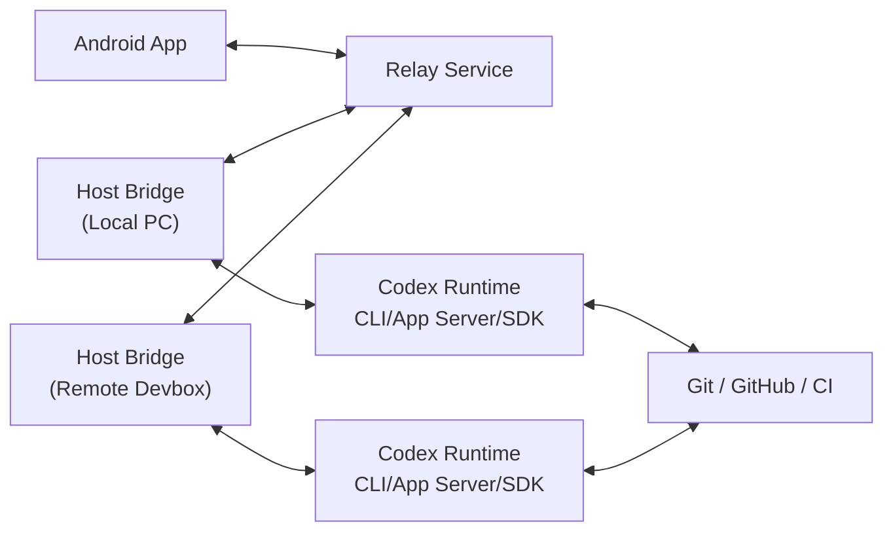
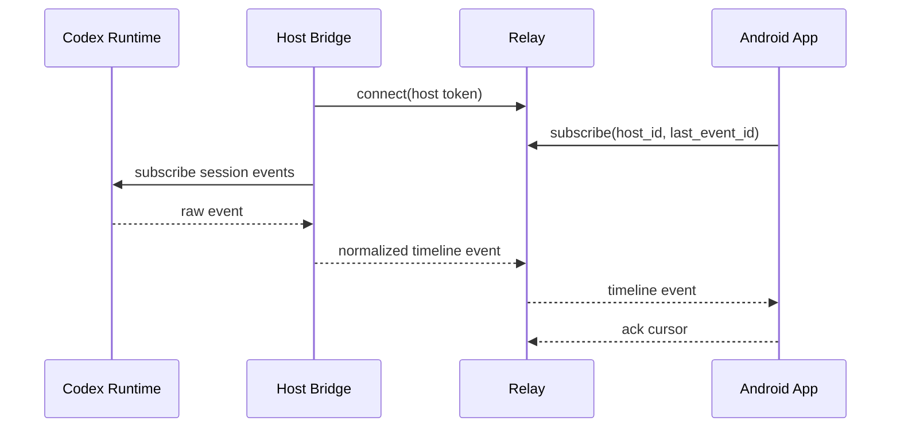
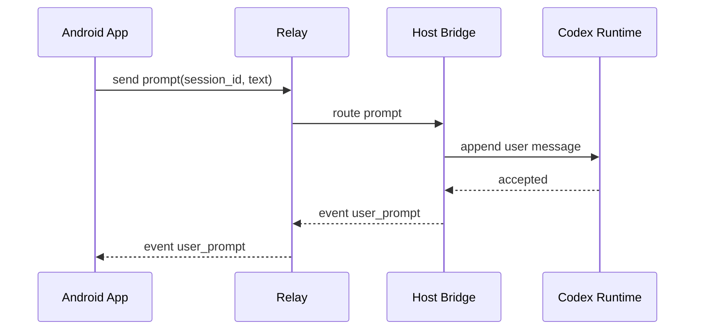
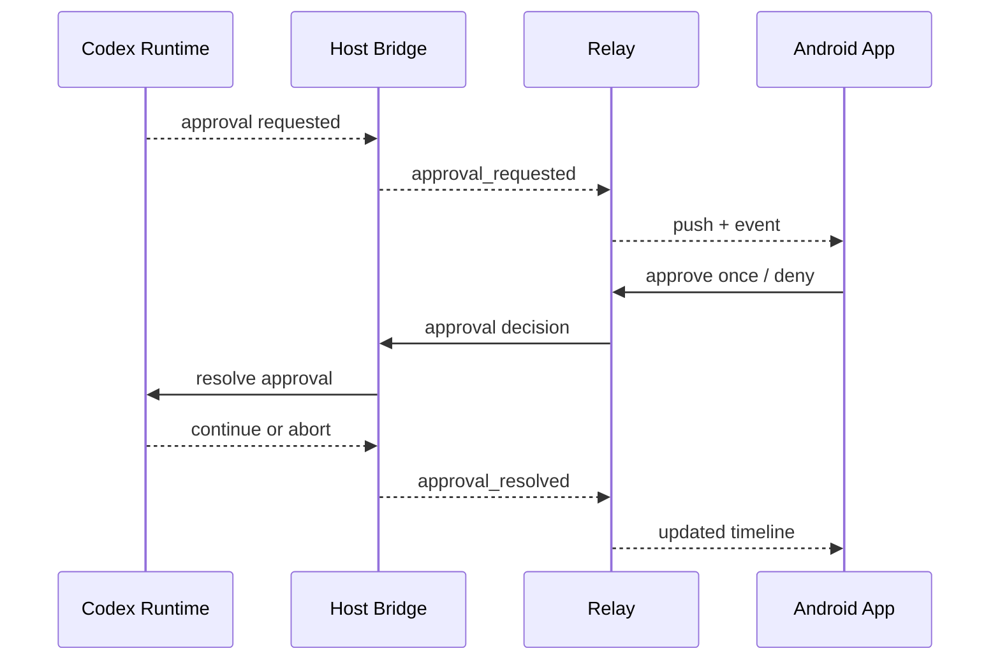

# Architecture

本文描述 Codex Mobile Companion 的初版架构。目标是让 Android 端成为 Codex 会话的信息流转窗口，而不是代码执行环境。

## 1. Architecture Goals

系统必须满足：

- Android 端可以实时或准实时查看 Codex session 状态。
- Android 端可以发送轻量 prompt、approval decision 和 Git action。
- 本地电脑不需要开放公网入站端口。
- 手机不直接持有 OpenAI token、SSH key、GitHub token 等长期敏感凭据。
- Relay 不长期保存仓库源码、完整 terminal log 或 secrets。
- Host Bridge 可以同时运行在本地电脑和云端开发机。
- 后续可以扩展到 GitHub PR、CI、团队权限和自托管 relay。

## 2. High-Level Components

## 3. Component Responsibilities

### 3.1 Android App

Android App 是用户主要入口。

职责：

- 登录、设备注册和 host 配对。
- 展示 host list、session list、session detail、approval inbox、diff review。
- 通过 WebSocket/SSE 接收 session event。
- 后台通过 push notification 唤醒并恢复 event cursor。
- 发送 prompt、approval decision 和 Git action。
- 使用 Android Keystore 保存设备密钥和 refresh token。
- 使用 Room 缓存最近 session 摘要、timeline cursor 和通知状态。

不负责：

- 不执行构建、测试或 shell 命令。
- 不保存仓库源码副本。
- 不保存 SSH key、GitHub token 或 OpenAI token。

建议技术栈：

- Kotlin。
- Jetpack Compose。
- Room。
- WorkManager。
- OkHttp WebSocket/SSE。
- Firebase Cloud Messaging 或兼容推送网关。

### 3.2 Relay Service

Relay Service 是会话路由和通知层。它可以由项目方托管，也可以提供自托管版本。

职责：

- 用户认证和 session token 管理。
- Android device registry。
- Host registry。
- 设备配对和 host 绑定。
- WebSocket/SSE route。
- Event cursor 和短期事件缓存。
- Push notification fanout。
- 审计日志。

不负责：

- 不直接执行 Codex。
- 不长期存储源码、完整 terminal log 或 secrets。
- 不替代 GitHub、CI 或 Codex Runtime。

建议技术栈：

- TypeScript + Node.js，或 Go。
- PostgreSQL 存储用户、host、device、session metadata 和 audit log。
- Redis 处理在线状态、短期事件缓存和 fanout。
- WebSocket 或 SSE 用于前台实时同步。
- FCM 用于 Android push。

### 3.3 Host Bridge

Host Bridge 是运行在用户电脑或服务器上的本地代理。它是系统中最靠近代码和 Codex Runtime 的组件。

职责：

- 向 Relay 建立出站 TLS 长连接。
- 注册 host 心跳、版本、能力集和在线状态。
- 列出 Codex projects、threads 或 sessions。
- 订阅 Codex session event。
- 归一化 Codex event 为移动端友好的 timeline event。
- 接收 Android 传来的 prompt、approval decision 和 Git action。
- 执行受控 Git 操作。
- 调用 Codex App Server/SDK 或 CLI adapter。
- 执行 host policy 中允许的动作。

不负责：

- 不绕过用户配置的 Codex 权限模型。
- 不默认执行高风险 shell 命令。
- 不把 secrets 上传到 Relay。

建议技术栈：

- TypeScript/Node.js 或 Rust。
- 本地配置文件存放 host policy。
- systemd service、Windows service 或 Docker 运行模式。

### 3.4 Codex Runtime

Codex Runtime 是现有 Codex 执行环境，包括：

- Codex CLI。
- Codex App Server/SDK。
- Codex Desktop App local/worktree/cloud threads。
- Git。
- shell。
- repo。
- test runner。
- MCP servers。

项目应优先使用官方稳定接口。如果 Codex App Server/SDK 覆盖不足，MVP 可以通过 CLI wrapper + PTY + 结构化日志 adapter 验证链路，但这不应成为长期架构。

## 4. Core Data Model

### 4.1 Host

Host 表示一台可以运行 Codex 的机器。

关键字段：

- `host_id`
- `display_name`
- `kind`: `local_pc` | `remote_devbox`
- `status`: `online` | `offline` | `degraded`
- `capabilities`
- `last_seen_at`
- `bridge_version`

### 4.2 Session

Session 表示一个 Codex thread/task。

关键字段：

- `session_id`
- `host_id`
- `project_name`
- `repo_path`
- `branch`
- `status`: `idle` | `running` | `waiting_for_input` | `waiting_for_approval` | `tests_running` | `failed` | `ready_for_review` | `completed`
- `summary`
- `last_event_id`
- `updated_at`

### 4.3 Timeline Event

Timeline Event 是移动端进度流的基本单元。

建议类型：

- `user_prompt`
- `assistant_message`
- `plan_update`
- `command_started`
- `command_finished`
- `file_changed`
- `test_result`
- `approval_requested`
- `approval_resolved`
- `git_status_changed`
- `git_action`
- `error`
- `summary`

每个事件都应有：

- `event_id`
- `session_id`
- `cursor`
- `created_at`
- `type`
- `title`
- `summary`
- `payload`
- `redaction_level`

Relay 会为收到的 timeline event 附加单调递增的 `cursor`，并按 session 保留短期内存缓存。客户端断线重连后可以在 `session.timeline.request` 或 `session.subscribe` 中携带 `after_cursor`，Relay 先补发缓存中 cursor 更大的事件，再按需把 timeline request 转发给 Host Bridge。

### 4.4 Approval Request

Approval Request 表示需要用户确认的动作。

关键字段：

- `approval_id`
- `session_id`
- `kind`: `shell` | `file_write` | `network` | `git_push` | `pr_create` | `dangerous_action`
- `title`
- `reason`
- `impact`
- `command_preview`
- `diff_summary`
- `risk_level`: `low` | `medium` | `high`
- `expires_at`
- `allowed_decisions`

### 4.5 Git Snapshot

Git Snapshot 用于移动端 review。

关键字段：

- `session_id`
- `branch`
- `base_branch`
- `status_summary`
- `files_changed`
- `insertions`
- `deletions`
- `file_diffs`
- `generated_commit_message`

## 5. Connection Modes

### 5.1 Local PC via Relay

默认推荐模式。

流程：

1. 用户在本地电脑启动 Host Bridge。
2. Host Bridge 生成 pairing code 或二维码。
3. Android 扫码并绑定 host。
4. Host Bridge 与 Relay 建立出站 TLS 长连接。
5. Android 通过 Relay 订阅该 host 的 sessions。

优点：

- 本地电脑无需公网 IP。
- 不需要开放入站端口。
- 手机不直接连接本地网络服务。

### 5.2 Remote Devbox via Relay

适合 VPS、云开发机或团队服务器。

流程与 Local PC 类似，但 Host Bridge 以 service/container 形式常驻运行。

### 5.3 Direct Private Network

高级用户可以通过 Tailscale、WireGuard、VPN 或 LAN 直连。

该模式可作为后续能力，不建议 MVP 首发，因为会增加网络配置复杂度和支持成本。

## 6. Event Flow

### 6.1 Session Sync

### 6.2 Prompt Command

### 6.3 Approval Decision

## 7. Security Model

### 7.1 Trust Boundaries

- Android App is trusted as a user-controlled device, but can be lost or compromised.
- Relay is trusted for routing and metadata, but should not be trusted with source code or secrets.
- Host Bridge is trusted to access local repo, Git credentials and Codex Runtime.
- Codex Runtime keeps existing Codex permission and sandbox behavior.

### 7.2 Authentication

Minimum requirements:

- User account session for Android.
- Device-bound key pair stored in Android Keystore.
- Host token stored on the host machine.
- Pairing token with short TTL.
- Refresh token rotation.

### 7.3 Authorization

Actions should be scoped by host, session and capability.

Examples:

- `session.read`
- `session.prompt`
- `approval.resolve`
- `git.status`
- `git.diff`
- `git.commit`
- `git.push`
- `host.admin`

### 7.4 Dangerous Operations

High-risk actions require explicit confirmation:

- `git push`
- PR creation.
- branch deletion.
- `rm -rf`, reset, clean, force push.
- deployment commands.
- commands touching production or secrets.

The confirmation UI should show command preview, impact, risk level and requested scope.

### 7.5 Redaction

Host Bridge should redact:

- Environment variables.
- Tokens and keys.
- Absolute secret paths when possible.
- Long raw terminal logs unless explicitly requested.

Relay should store only redacted event summaries by default.

## 8. API Surface

Initial API can be small:

- `POST /auth/login`
- `POST /devices/register`
- `POST /pairing/start`
- `POST /pairing/complete`
- `GET /hosts`
- `GET /hosts/{host_id}/sessions`
- `GET /sessions/{session_id}/events?after=...`
- `POST /sessions/{session_id}/prompt`
- `POST /approvals/{approval_id}/decision`
- `GET /sessions/{session_id}/git/status`
- `GET /sessions/{session_id}/git/diff`
- `POST /sessions/{session_id}/git/commit`
- `POST /sessions/{session_id}/git/push`

Real-time channel:

- Android to Relay: WebSocket/SSE subscription.
- Host Bridge to Relay: WebSocket or bidirectional gRPC stream.

## 9. MVP Architecture Decisions

- Use Relay even for local PC mode to avoid requiring inbound ports.
- Keep Host Bridge as the only component allowed to touch repos and Git credentials.
- Keep Android UI event-driven, with local cache and event cursor recovery.
- Normalize Codex output into timeline events instead of streaming raw terminal output as the primary UI.
- Use Git actions through Host Bridge policy, not direct Git credentials on Android.

## 10. Open Questions

- Codex App Server/SDK 的事件和命令覆盖面是否足够。
- Approval request 是否能通过官方接口稳定捕获和回复。
- Codex Cloud 官方任务是否有可用 API 支持第三方移动端订阅。
- 初版 Relay 是否需要多租户，还是先做单用户自托管。
- GitHub PR 能力应直接接 GitHub API，还是通过 Codex/Git CLI 间接完成。
